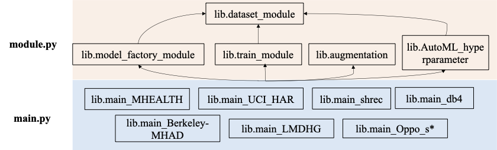
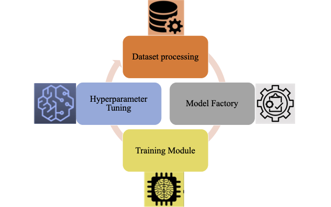

# AutoMR
AutoMR: A Universal Automatic Time Series Motion Recognition Pipeline


Motion recognition projects often encounter challenges such as complex hyperparameter tuning, diverse dataset formats, and the integration of heterogeneous data sources. Achieving optimal recognition accuracy while automating model construction, evaluation, and deployment remains a significant hurdle.

This library addresses these challenges by simplifying the processes of model training, evaluation, AutoMR, and deployment. It offers an end-to-end, modular architecture designed for seamless customization and extension, enabling efficient handling of multi-source datasets and delivering superior recognition accuracy.

## Features
- **Customized Dataset:** Alternative options for your personalized object recognition dataset.
- **Modular Design:** Easily formalized and extensible components, such as data loaders, models, and optimizers, providing flexibility for customization and seamless integration into diverse workflows.
- **Multi-GPU Support:** Efficiently train models on multiple GPUs using distributed training strategies.
- **Logging and Visualization:** Integrated logging and visualization tools for monitoring training progress.
- **Real-time Evaluation and Save:** Provide real-time classification report and confusion matrix for full-scope evaluation of the recognition, the best accuracy and model will be saved after the training.
- **Easy Deployment:** Seamlessly deploy quanitzed models into designated hardwares.
- **Hyperparameter Tuning:** Built-in support for hyperparameter tuning, optimization and automl.

## Table of Contents
- [Library Structure](#library-structure)
- [Pipeline Process](#pipeline-process)
- [Installation](#installation)
- [Quick Start](#quick-start)
- [Customized Usage](#usage)
  - [Data Preparation](#data-preparation)
  - [Deployment](#model-training)


## Library Structure


## Pipeline Process


## Installation
It is recommended to use a virtual environment to manage dependencies. You can install the required packages using:
```sh
# Create and activate a virtual environment (optional)
python -m venv venv
source venv/bin/activate  # On macOS/Linux
venv\Scripts\activate     # On Windows

# Install dependencies
pip install -r requirements.txt
```

## Quick Start
We have integrated 10 public datasets including SHREC2021, MHEALTH, UCI-HAR, DB4, Berkeley-MHAD, LMDHG, OPPOTUNITY S1, OPPOTUNITY S2, OPPOTUNITY S3, OPPOTUNITY S4. Beginners could start from MHEALTH and LMDHG.

To initiate the training process on the * dataset:

- **With manual hyperparameter tuning**, run:
  ```sh
  python main_*.py

- **With automatic hyperparameter tuning**, run:
  ```sh
  python main_*_Auto.py

## Customized Usage

You can employ your own dataset by following the format supported in `dataset_module.py`.

### Supported Data Formats

#### 1. SHREC2021 Dataset
- **Data Format**: Continuous gesture data, where each gesture is labeled from its start to end time.
- **Input Data**: Each gesture is represented by sensor data from a time window.
- **Sensor Data**: The data may consist of different types (IMU, joint data, EMG), depending on the selected modality.
- **Data Shape**: Each gesture is represented by data in the shape of (samples, features).
- **Labels**: Each gesture segment (time window) is labeled with a gesture class.
- **Supported Modalities**: IMU, Joint Data (JOINT), EMG.

#### 2. UCI HAR Dataset
- **Data Format**: Each row of data corresponds to a clearly defined label, independent of time periods.
- **Input Data**: Sensor data for each sample, using the IMU modality.
- **Data Shape**: (samples, features), where each sample represents a single action.
- **Labels**: Each row corresponds to a label representing an action (e.g., walking, running, etc.).
- **Supported Modality**: IMU.

#### 3. DB4 Dataset
- **Data Format**: Each row of data corresponds to a specific labeled action.
- **Input Data**: Sensor data can be in the EMG modality.
- **Data Shape**: (samples, features), with each sample representing a single action.
- **Labels**: Each row of data corresponds to an action label.
- **Supported Modality**: EMG.

#### 4. MHEALTH Dataset
- **Data Format**: Each row of data corresponds to a clearly defined label, independent of time periods.
- **Input Data**: Sensor data using the IMU modality.
- **Data Shape**: (samples, features), where each sample represents a single action.
- **Labels**: Each row corresponds to an action label.
- **Supported Modality**: IMU.

#### 5. LMDHG Dataset
- **Data Format**: Image data, where the label corresponds to the gesture for each image.
- **Input Data**: Image data in .png, .jpg, or .jpeg formats.
- **Data Shape**: Each image is converted into a 2D array.
- **Labels**: Labels are extracted from the filename, representing the gesture for each image.
- **Supported Modality**: Image data.
